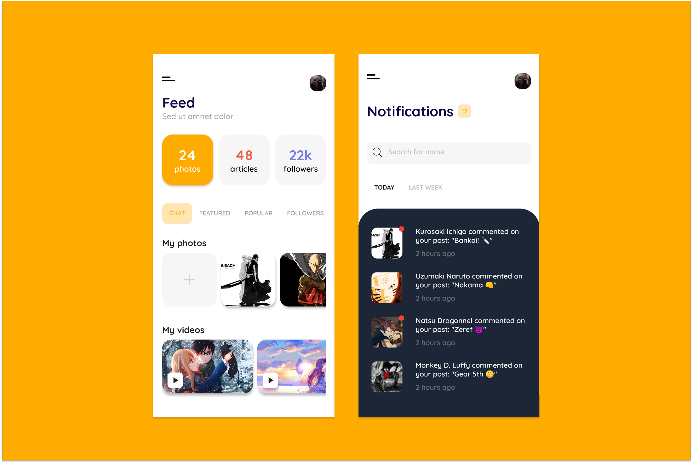
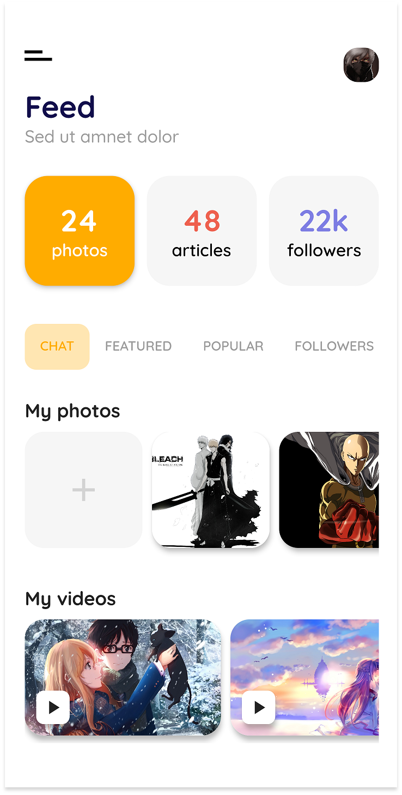

# Flutter Ghana UI Challenge Week 1 - Social Media App

A Flutter UI implementation of a Social Media App inspired by <a href="https://dribbble.com/outcrowd">Outcroud's</a> desgin on <a href="https://dribbble.com/shots/6659481-Mobile-app-Social-media-network">Dribble</a>.

Star this repo if you like what you see.

## 📸 Screenshots

 

## Author(s)
**Emmanuel Fache**

## Getting Started

**Note**: Make sure your Flutter environment is setup.
#### Installation

In the command terminal, run the following commands:

    $ git clone https://github.com/emrade/flutter-ghana-ui-challenge-week-1.git ui_challenge
    $ cd ui_challenge/
    $ flutter packages get
    $ flutter run

##### Check out Flutter’s online [documentation](http://flutter.io/) for help getting started with your Flutter project.
